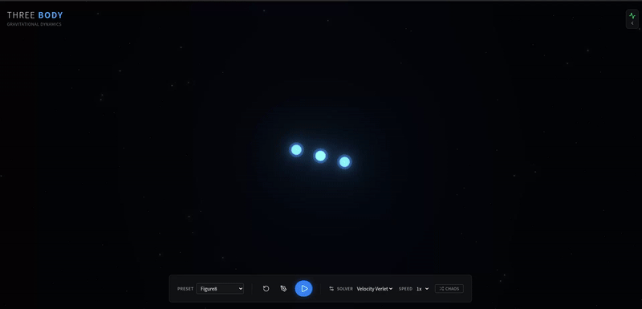
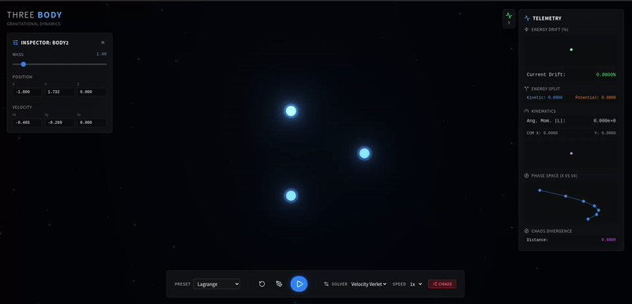

<div align="center">

# 🪐 THREE BODY SIMULATION 

**[ HIGH-PERFORMANCE GRAVITATIONAL DYNAMICS ENGINE ]**

[](https://python.org)
[](https://docs.pmnd.rs/react-three-fiber/)
[](https://fastapi.tiangolo.com)
[](https://vitejs.dev/)

<br/>

> *An interactive scientific visualization of the N-Body problem, rendered in an immersive 3D spatial environment. Designed for chaos exploration, numerical integrator analysis, and orbital choreography.*

<br/>

</div>

## 🛰️ SYSTEM DEMONSTRATION

<div align="center">
  <table style="border: none; border-collapse: collapse;">
    <tr>
      <td align="center" width="50%" style="border: none;">
        <b>ORBITAL CHOREOGRAPHY : FIGURE-8</b><br/><br/>
        
        <br/><br/><i>Stable 3-body system governed by Velocity Verlet integration.</i>
      </td>
      <td align="center" width="50%" style="border: none;">
        <b>EQUILIBRIUM: LAGRANGE TRIANGLE</b><br/><br/>
        
        <br/><br/><i>Exploring mass distribution and stability nodes.</i>
      </td>
    </tr>
  </table>
</div>

<br/>

## 🔬 CORE FEATURES

- 💠 **Progressive Dynamics:** Seamlessly toggle between 1, 2, and 3-body configurations.
- ⚙️ **Numerical Integrators:** Compare engine precision live between **Velocity Verlet** (symplectic), **RK4** (high precision), and **Euler** (divergent).
- 🦋 **Chaos Engine:** Spawn perturbed copies to track trajectory divergence and visualize the *Butterfly Effect* in real-time.
- 📊 **Live Telemetry:** Monitor system energy conservation, angular momentum, and center-of-mass drift.
- 🌌 **Sci-Fi Aesthetic:** Additive-blend orbital trails, Unreal bloom post-processing, and interactive camera controls.

---

## 🏗️ ARCHITECTURE & TELEMETRY

The system operates on a decoupled client-server architecture, communicating via high-frequency WebSockets (~60Hz telemetry stream).

```text
[ CLIENT ]                                    [ SERVER ]
 React 18 + R3F           (WebSocket)         FastAPI + uvicorn
 Zustand State   <=========================>  Python 3.11 Physics Engine
 UnrealBloomPass                              NumPy Vectorized Math
```

### 🧮 Numerical Core
The physics engine resolves Newton's law of universal gravitation:

$$ \mathbf{F}_i = \sum_{j \neq i} \frac{G m_i m_j}{|\mathbf{r}_j - \mathbf{r}_i|^3} (\mathbf{r}_j - \mathbf{r}_i) $$

<details>
<summary><b>View Integrator Specifications</b></summary>
<br>

- **Velocity Verlet:** Used as the default solver. It is a symplectic integrator, meaning it perfectly conserves phase-space volume, yielding exceptional energy stability for orbital mechanics over long durations.
- **Runge-Kutta 4 (RK4):** A 4th-order method offering extremely high precision per step, at the cost of 4 force evaluations.
- **Euler Method:** Included purely for educational contrast. Highlights rapid energy drift and orbital decay in complex systems.
</details>

---

## 🚀 INITIALIZATION SEQUENCE

Ensure you have **Node.js (v18+)** and **Python (3.11+)** installed on your terminal. We utilize [uv](https://github.com/astral-sh/uv) for hyper-fast Python dependency resolution.

### 1. Boot Backend Server
```bash
cd backend
uv venv
source .venv/bin/activate  # (Windows: .venv\Scripts\activate)
uv pip install -r requirements.txt
uvicorn app.main:app --reload
```
📡 *Telemetry server running on `http://localhost:8000`*

### 2. Boot Rendering Engine
```bash
cd frontend
npm install
npm run dev
```
🌌 *Renderer active on `http://localhost:5173`*

---

<div align="center">
  <p>Engineered with ⚛️ for physics enthusiasts and developers.</p>
  <a href="LICENSE">MIT License</a>
</div>