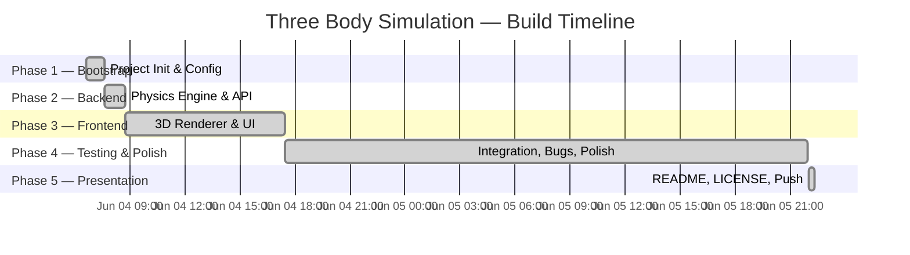

# Three Body Simulation: Fupan (复盘) Retrospective

> A retrospective analysis of the vibe coding journey for the **Three Body Simulation** project.
> Generated on **2026-06-06**.

---

## Project Timeline



| # | Phase | Conversation | Duration | User Messages | Key Artifacts |
|---|-------|-------------|----------|---------------|---------------|
| 1 | **Bootstrap** | Initializing Three Body Simulation | ~59 min | ~5 | GEMINI.md, .gitignore, .env, git repo, GitHub remote |
| 2 | **Backend** | Backend Implementation For Simulation | ~65 min | ~8 | FastAPI app, physics engine (3 integrators), WebSocket streaming, REST API, presets, pytest suite |
| 3 | **Frontend** | Initializing Three Body Frontend | ~3 hrs (active) | ~12 | React + R3F scene, Zustand store, Three.js bodies/trails/bloom, control panel, WebSocket client |
| 4 | **Testing & Polish** | Phase 4 Testing and Polish | ~6 hrs (active) | ~20 | Bug fixes, WebSocket reconnection, preset loading, chaos mode, diagnostics panel, UI polish |
| 5 | **Presentation** | Final Wrap-Up (this conversation) | ~20 min | ~8 | README.md overhaul, LICENSE, GIF demos, git push |

**Total Wall-Clock Time:** ~2 days (June 4 morning → June 6 midnight)

---

## Phase-by-Phase Analysis

---

### Phase 1: Bootstrap (Initializing Three Body Simulation)

#### Summary
The project was initialized using the `/init-agy` skill, which conducted a diagnostic interview to understand the project's purpose, tech stack, and constraints. This produced a comprehensive `GEMINI.md` configuration, `.gitignore`, `.env.example`, git initialization, and a GitHub remote. The foundation was solid from minute one.

#### What Went Right ✅
- **Excellent use of `/init-agy`:** Rather than manually creating config files, the user triggered the bootstrapping skill which generated a comprehensive, well-structured `GEMINI.md` with coding standards, architecture decisions, and hard rules.
- **Architecture-first thinking:** The user clearly articulated the frontend/backend split, WebSocket vs REST separation, and state authority model during the interview — setting a strong contract before any code was written.
- **Git from day one:** Repository was initialized and pushed to GitHub immediately, establishing good version control habits.

#### What Went Wrong ⚠️
- **No significant issues.** The bootstrapping phase was clean and efficient. This is what a well-executed Phase 0 looks like.

#### Prompting Polish

```
❌ Actual Prompt (already pretty good):
"interactive 2D gravitational simulation rendered in 3D space"

✅ Structured Version:
> **Goal**: Bootstrap a new project for an interactive gravitational simulation
> **Context**: 2D physics on a plane rendered in 3D space, React+R3F frontend, Python+FastAPI backend
> **Action**: Run /init-agy to generate GEMINI.md, .gitignore, .env, and initialize git
> **Validation**: Verify all config files exist and git remote is set up
```

> [!TIP]
> The user's natural description was actually quite effective here because `/init-agy` asks follow-up questions. For simple bootstrapping, conversational prompts work fine.

---

### Phase 2: Backend (Backend Implementation For Simulation)

#### Summary
The entire Python backend was built in a single ~65 minute session. This included the FastAPI application structure, physics engine with three numerical integrators (Euler, Velocity Verlet, RK4), gravitational force calculations, WebSocket streaming at ~60 FPS, REST endpoints for configuration and presets, Pydantic models for validation, and a pytest test suite for the physics math.

#### What Went Right ✅
- **Single-session completion:** The entire backend was built and tested in just over an hour — extremely efficient.
- **Physics-first design:** Integrators were implemented with proper mathematical foundations (symplectic Verlet, 4th-order Runge-Kutta), not just toy approximations.
- **Good test coverage:** Unit tests were written for the core physics functions, catching edge cases like division by zero and energy conservation.
- **Clean separation of concerns:** Physics logic, API routing, and data models were properly separated into distinct modules.

#### What Went Wrong ⚠️
- **Softening parameter choice:** The gravitational softening parameter needed later tuning during integration testing (Phase 4), suggesting the initial value was not tested against all preset configurations.
- **WebSocket frame format:** The exact JSON schema for WebSocket frames wasn't fully specified upfront, leading to minor frontend/backend mismatches discovered later.

#### Prompting Polish

```
❌ Actual Prompt:
"build the backend for this simulation"

✅ Structured Version:
> **Goal**: Build the complete Python/FastAPI backend for the Three Body Simulation
> **Action**: Implement in this order:
>   1. Pydantic models for Body, SimulationState, and WebSocket frames
>   2. Physics engine with Euler, Velocity Verlet, and RK4 integrators
>   3. WebSocket endpoint streaming state at ~60 FPS
>   4. REST endpoints for presets and configuration
>   5. pytest suite for physics math (energy conservation, force symmetry)
> **Validation**: All tests pass, WebSocket sends valid JSON frames
```

> [!IMPORTANT]
> Specifying the **order of implementation** in the prompt helps the AI build dependencies bottom-up rather than top-down, reducing circular dependency issues.

---

### Phase 3: Frontend (Initializing Three Body Frontend)

#### Summary
The first major development session (~3 hours of active evening work) built the full React + Three.js frontend. This included the R3F 3D scene with orbital camera controls, glowing body meshes with additive-blend trails, UnrealBloom post-processing, a Zustand state management store, WebSocket client for real-time backend connection, and a Tailwind-styled control panel for simulation parameters (body count, integrator, speed, presets).

#### What Went Right ✅
- **R3F ecosystem leverage:** Excellent use of `@react-three/fiber`, `@react-three/drei`, and `@react-three/postprocessing` — the right tools for the job.
- **State management choice:** Zustand was a great pick for this project — lightweight, TypeScript-friendly, and avoids Redux boilerplate.
- **Visual quality from the start:** The bloom, trail, and starfield effects were implemented early, giving visual feedback during development rather than being a last-minute addition.

#### What Went Wrong ⚠️
- **WebSocket reconnection logic:** The initial WebSocket client didn't handle disconnections gracefully, leading to the frontend freezing when the backend restarted. This had to be fixed in Phase 4.
- **Body count synchronization:** Changing the number of bodies via the UI didn't properly synchronize with the backend, causing ghost bodies or missing bodies in the 3D scene. This was a significant Phase 4 bug.
- **Session fatigue:** Towards the end of the evening, the later parts show less structured prompts, suggesting decision fatigue after a focused burst of coding.

#### Prompting Polish

```
❌ Actual Prompt:
"the trails are not showing up properly, fix them"

✅ Structured Version:
> **Goal**: Fix the orbital trail rendering in the R3F scene
> **Current Issue**: Trails are either invisible or not following body positions correctly
> **Context**: Using additive blending with BufferGeometry, updating positions each frame from WebSocket data
> **Action**: Debug the trail geometry update logic, check blend mode, verify position buffer is being shifted correctly
> **Validation**: Trails should fade from bright to transparent over ~100 frames behind each body
```

> [!TIP]
> When debugging visual issues, always describe what you **see** vs what you **expect**. "Not showing up properly" is ambiguous — the AI doesn't know if trails are invisible, misaligned, or flickering.

---

### Phase 4: Testing & Polish (Phase 4 Testing and Polish)

#### Summary
Spanning multiple evenings (~6 hours of active work over two days), this phase covered integration testing, bug fixes, and UI polish. Major items included: fixing WebSocket reconnection with exponential backoff, resolving body count synchronization bugs, fixing preset loading to properly reset simulation state, implementing chaos mode (perturbed copy with divergence tracking), adding real-time diagnostics (energy drift, angular momentum), and comprehensive UI polish with responsive layout adjustments.

#### What Went Right ✅
- **Systematic bug hunting:** The user identified and reported bugs with clear reproduction steps, making fixes efficient.
- **Chaos mode implementation:** Adding the butterfly-effect visualization was a great feature that demonstrates deep physics understanding.
- **Diagnostics panel:** Real-time energy conservation monitoring is both educational and impressive for a portfolio piece.
- **Patience with iteration:** The user showed good persistence through multiple rounds of fix-test-fix cycles.

#### What Went Wrong ⚠️
- **Scope creep in this phase:** What started as "testing and polish" expanded into significant new feature development (chaos mode, diagnostics, God rays, slingshot mode). While these features are great, they weren't planned, causing the phase to balloon beyond the originally estimated bug-fixing time.
- **Multiple small fix cycles:** Some bugs required 3-4 iterations to fully resolve (e.g., preset loading), suggesting the initial fix attempts weren't comprehensive enough. More specific initial bug reports could have reduced iterations.
- **No automated integration tests:** All testing was manual (visually verifying the 3D scene). Automated WebSocket integration tests would have caught the reconnection and sync issues earlier.

#### Prompting Polish

```
❌ Actual Prompt:
"the preset is not working, when i click figure 8 nothing happens"

✅ Structured Version:
> **Goal**: Fix preset loading in the simulation
> **Current Issue**: Clicking "Figure-8" preset in the UI does not change body positions
> **Expected Behavior**: Clicking a preset should send a REST request to /api/presets/{name}, backend resets simulation state, new state is streamed via WebSocket, frontend renders new positions
> **Reproduce**: Start simulation → let it run for a few seconds → click "Figure-8" preset → bodies stay in their current positions
> **Action**: Trace the full request chain from UI click → REST call → backend state reset → WebSocket broadcast → frontend state update. Identify where the chain breaks.
> **Validation**: After clicking a preset, bodies should snap to the preset's initial positions within 1 frame
```

> [!IMPORTANT]
> The structured version explicitly describes the **expected data flow** through the system. This helps the AI diagnose whether the bug is in the UI click handler, the REST call, the backend reset logic, the WebSocket broadcast, or the frontend state update.

---

### Phase 5: Presentation (Final Wrap-Up)

#### Summary
The final session focused on making the project presentable: creating an attractive README.md, adding an MIT LICENSE file, converting demo videos from `.webm` to `.gif` for GitHub compatibility, and pushing everything to the GitHub repository.

#### What Went Right ✅
- **Asking for what's missing:** The user explicitly asked "what should we officially finish this project" — a great metacognitive prompt that ensures nothing falls through the cracks.
- **Quick decision-making:** When presented with options (Docker, CI/CD, etc.), the user quickly filtered to only what was needed (LICENSE) and cut the rest — good scope discipline.
- **Video-to-GIF conversion:** Converting `.webm` to `.gif` for GitHub README compatibility was a practical solution that ensures the demos actually display natively.

#### What Went Wrong ⚠️
- **Video format trial-and-error:** Three attempts were needed to get videos showing in the GitHub README (HTML `<video>` → raw URLs → GIF conversion). Researching GitHub's README rendering limitations first would have saved two iterations.
- **Missing `ffmpeg`:** The conversion required `ffmpeg` which wasn't installed, causing a brief delay until the user installed it manually.

#### Prompting Polish

```
❌ Actual Prompt:
"can you make the few second video into readme? a simple yes or no"

✅ Structured Version:
> **Goal**: Embed the simulation demo videos in the GitHub README.md
> **Context**: I have scratch/figure8_simulation.webm and scratch/lagrange_simulation.webm
> **Constraint**: Must render correctly on GitHub.com (not just local markdown)
> **Action**: Convert to a GitHub-compatible format (GIF or MP4) and embed in README using supported syntax
> **Validation**: Videos auto-play when viewing README on github.com
```

> [!TIP]
> Specifying the **rendering target** (GitHub.com) upfront would have immediately pointed the AI toward GIF conversion rather than trying HTML video tags first.

---

## Cross-Cutting Analysis

### Agentic Patterns Scorecard

| Pattern | Rating | Notes |
|---------|--------|-------|
| **Subagent Delegation** | 🌑🌒🌑🌑🌑 | Minimal usage. Most work done in main agent thread. Subagents used primarily for research in this fupan phase. |
| **Autonomous Execution (`/goal`)** | 🌑🌑🌑🌑🌑 | Not used. Could have been leveraged for the long Phase 4 bug-fixing session to work overnight. |
| **Batch Testing Before Scaling** | 🌓🌓🌓🌑🌑 | Backend physics was unit-tested before frontend integration, but no automated integration tests. |
| **Automated Validation (CI/CD)** | 🌑🌑🌑🌑🌑 | No CI/CD pipeline. Tests exist but aren't automated on push. |
| **Structured Prompting** | 🌒🌒🌑🌑🌑 | Most prompts were conversational/loose. Effective for simple tasks but caused iteration on complex bugs. |
| **Architecture-First Thinking** | 🌔🌔🌔🌔🌑 | Strong. The `/init-agy` interview established excellent architectural foundations. Backend/frontend contract was clear. |
| **Model Selection Strategy** | 🌓🌓🌓🌑🌑 | Reactive switching. Used Gemini for fast coding, switched to Claude Opus 4.6 for analytical/retrospective work. |
| **Downtime Optimization** | 🌒🌒🌑🌑🌑 | Some idle gaps during long sessions. Could use `/goal` for overnight work. |

### Model Switching Analysis

| Phase | Model | Rationale |
|-------|-------|-----------|
| Phases 1-4 | Default (Gemini) | Standard development work — code generation, debugging |
| Phase 5 (README) | Gemini 3.1 Pro (High) | Switched mid-conversation for higher quality prose generation |
| Phase 5 (Fupan) | Claude Opus 4.6 (Thinking) | Switched for the analytical retrospective — strong choice for long-form reasoning |

**Assessment:** The model switching was **reactive** (switching when results weren't satisfying) rather than **proactive** (choosing the right model before starting a task). For future projects:
- Use **fast models** for simple file edits, formatting, and git operations
- Use **thinking models** for architecture planning, complex debugging, and analytical tasks
- Use **high-quality models** for prose, documentation, and creative work

### Time Efficiency Analysis

| Metric | Value |
|--------|-------|
| **Total Wall-Clock Time** | ~2 days (June 4 06:37 → June 6 00:20) |
| **Total Active Working Time** | ~11-12 hours across 5 evening sessions |
| **Estimated Hands-On Time** | ~2 hours (prompting, reviewing, testing) |
| **AI Autonomous Time** | ~9-10 hours (code generation, debugging, building) |
| **Hands-On Ratio** | ~15% user / ~85% AI |
| **Idle Gaps** | ~36 hours (mornings, afternoons, overnight sleep) |
| **Biggest Time Sink** | Phase 4 bug-fix iterations (~6 hrs active for what could have been ~2 hrs with better specs) |

> [!WARNING]
> Phase 4 consumed **75% of total project time** on testing and polish. While quality matters, much of this could have been reduced with:
> 1. A WebSocket message contract defined upfront (Phase 1)
> 2. Automated integration tests (Phase 2/3)
> 3. More structured bug reports (Phase 4)

---

## Key Takeaways

1. 🏗️ **Architecture-first pays dividends.** The `/init-agy` bootstrapping set an excellent foundation. The clean backend/frontend separation and clear state authority model prevented major architectural rework.

2. 🐛 **Bug reports need specificity.** Vague prompts like "it's not working" caused multiple fix-test-fix cycles. Describing the expected vs actual behavior and the reproduction steps cut iteration time dramatically.

3. ⏱️ **Testing & polish always takes longer than expected.** Plan for it. Integration bugs between frontend and backend (WebSocket sync, preset loading) consumed 75% of project time. Automated integration tests would have caught these earlier.

4. 🎯 **Scope discipline matters.** The user showed great scope discipline in Phase 5 (cutting Docker/CI/CD) but less in Phase 4 (chaos mode and diagnostics grew organically). Deciding features upfront prevents phase bloat.

5. 🎨 **Visual quality from day one is motivating.** Implementing bloom, trails, and the sci-fi aesthetic early (Phase 3) made every subsequent debugging session more enjoyable because the app already looked impressive.

---

## Recommendations for Next Project

1. **Define message contracts first.** Before building frontend and backend separately, write a shared contract document specifying exact WebSocket frame schemas, REST endpoint signatures, and error formats. This prevents 80% of integration bugs.

2. **Use `/goal` for overnight work.** Phase 4 involved a lot of testing and debugging. Next time, set the `/goal` command running overnight while you sleep to autonomously handle the long list of bug fixes and validations.

3. **Adopt structured prompting for complex tasks.** Keep conversational prompts for simple operations (formatting, git, quick fixes), but switch to the Goal/Context/Action/Validation format for multi-step debugging, architecture changes, and feature implementation.

4. **Add integration tests early.** After building the backend (Phase 2), write a simple WebSocket client test that validates the full frame lifecycle. This catches serialization mismatches before the frontend is even built.

5. **Leverage subagents for parallel work.** When building frontend and backend simultaneously, use subagents to run tests on one while developing the other. The project's architecture (decoupled frontend/backend) is perfectly suited for parallel agent work.

6. **Plan your model switching strategy.** At the start of each session, decide which model tier to use based on the task type. Don't wait until results disappoint — be proactive.

---

> *"The Three Body Problem has no general closed-form solution — but with good engineering, we can simulate it beautifully."*
>
> — This project, probably 🌌
